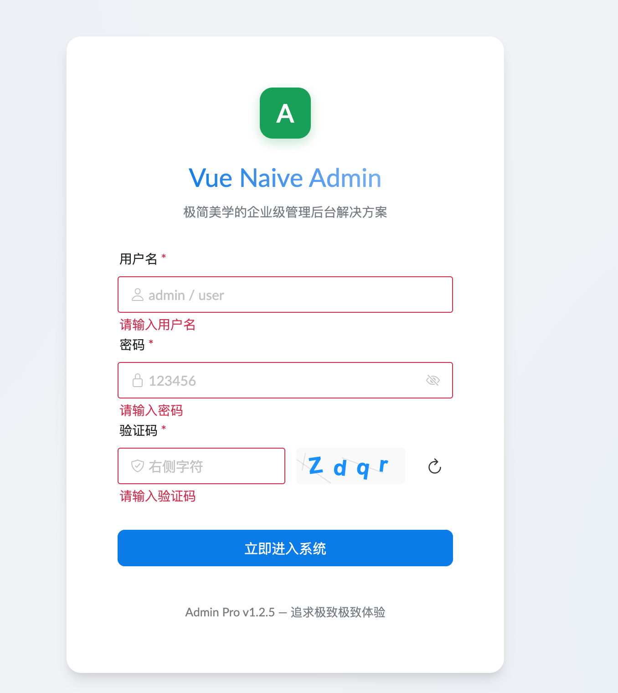
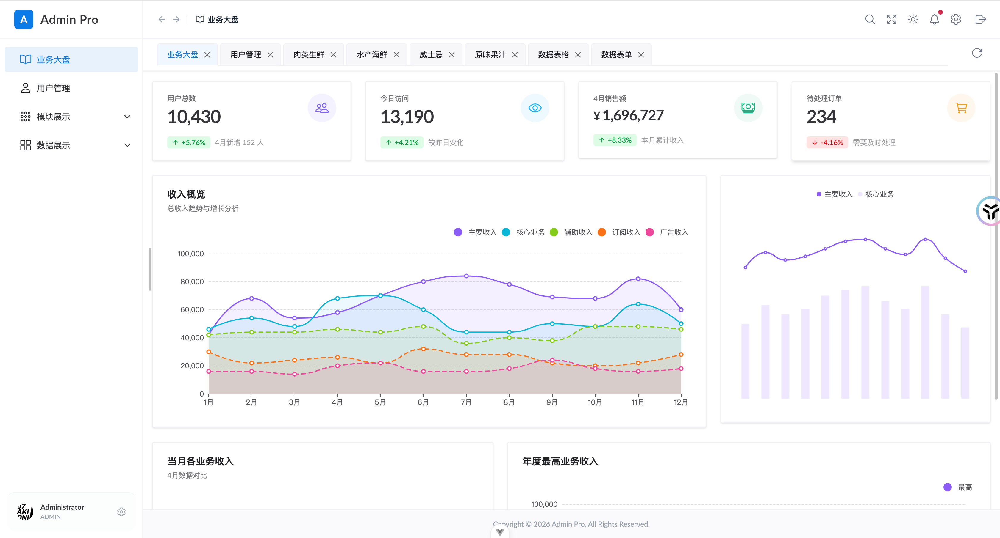
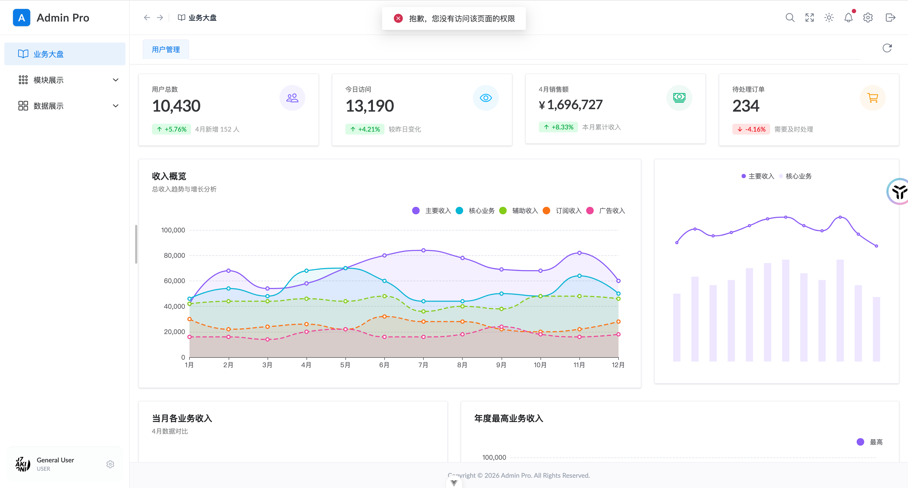
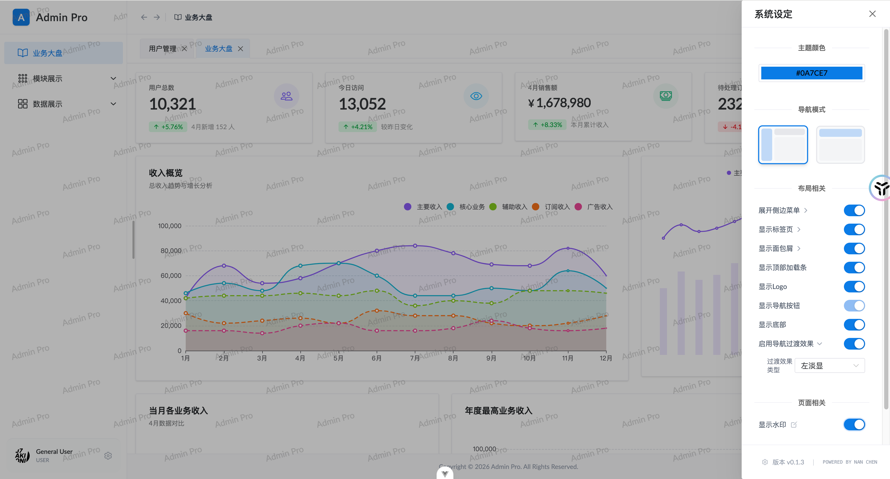

# Vue 3 + Naive UI 企业级后台管理系统完整解析

先看效果
login页面支持角色权限功能


管理员端


普通用户端


功能模块：


## naiveui_admin 项目完整目录结构文档

---

### 第一部分：项目概述和根目录结构

项目名称：`naiveui_admin`
GitHub URL : [<u>https://github.com/NanChen042/naiveui_admin</u>](https://github.com/NanChen042/naiveui_admin)
项目ID : 1198318955
主要技术栈：

- Vue3：58.4%

- TypeScript：40.5%

- 其他：1.1%

这是一个基于Vue 3 + TypeScript + NaiveUI的现代化后台管理系统模板。项目使用Vite作为构建工具，提供了完整的后台管理系统框架，包括身份验证、权限管理、动态路由、数据可视化等功能。

#### 根目录结构

代码

```text
naiveui_admin/
├── .gitignore                  # Git 忽略文件
├── .prettierrc.json            # Prettier 代码格式化配置
├── .vscode/                    # VSCode 配置目录
│   └── extensions.json         # 推荐使用的 VSCode 扩展列表
├── README.md                   # 项目说明文档
├── auto-imports.d.ts           # 自动导入类型定义（根目录��
├── components.d.ts             # 组件自动注册类型定义（根目录）
├── docs/                       # 文档目录
│   └── VUE_ADMIN_TEMPLATE_GUIDE.md  # Vue 后台管理模板指南
├── env.d.ts                    # 环境变量类型定义
├── index.html                  # HTML 入口文件
├── package.json                # npm 依赖管理配置
├── pnpm-lock.yaml              # pnpm 依赖锁定文件
├── public/                     # 静态资源目录
│   └── favicon.ico             # 网站图标
├── src/                        # 源代码目录（核心业务逻辑）
├── tsconfig.json               # TypeScript 基础配置
├── tsconfig.app.json           # TypeScript 应用配置
├── tsconfig.node.json          # TypeScript Node 配置
└── vite.config.ts              # Vite 构建配置
```

#### 关键配置文件说明

package.json - 项目依赖和脚本配置，包含：

- Vue 3 核心框架

- NaiveUI 组件库

- Vue 路由器路由管理

- Pinia 状态管理

- TypeScript 开发工具

vite.config.ts - Vite 构建工具配置，用于开发和生产环境的构建管理

tsconfig.json - TypeScript 编译器配置，确保类型安全和开发体验

.vscode/extensions.json - VSCode推荐扩展，为开发者提供最佳开发环境

---

### 第二部分：src目录核心结构

`src`目录是项目的核心源代码目录，采用定制架构设计，分为以下主要部分：

代码

```text
src/
├── App.vue                     # 根组件
├── main.ts                     # 应用入口文件
├── auto-imports.d.ts           # 自动导入类型定义
├── components.d.ts             # 组件自动注册定义
├── api/                        # API 接口层
├── assets/                     # 静态资源（样式、图片等）
├── components/                 # 可复用组件
├── config/                     # 全局配置
├── directives/                 # 自定义指令
├── hooks/                      # 组合式 API 钩子
├── layouts/                    # 布局模板
├── router/                     # 路由配置
├── store/                      # 旧版状态管理（已迁移）
├── stores/                     # Pinia 状态管理
├── utils/                      # 工具函数库
└── views/                      # 页面视图组件
```

---

### 第三部分：API层详细结构

路径:`src/api/`

API层负责处理所有前端交互接口的调用，实现前端交互数据。

代码

```text
src/api/
├── index.ts                    # API 入口文件
├── auth.ts                     # 身份验证相关 API
│   └── 导出登录、注册、登出等认证接口
├── user.ts                     # 用户管理 API
│   ├── 获取用户列表
│   ├── 获取用户详情
│   ├── 创建用户
│   ├── 修改用户信息
│   └── 删除用户
└── system.ts                   # 系统级 API
    ├── 获取系统配置
    └── 更新系统参数
```

auth.ts文件内容分析：

- 集成登录接口

- 处理令牌刷新机制

- 实现登出功能

user.ts文件内容分析：

- 用户查询列表

- 单个用户获取

- 用户新增、修改、删除的 CRUD 操作

system.ts文件内容分析：

- 系统配置管理

- 参数全局获取和更新

---

### 第四部分：资源和配置管理

#### 4.1 资产目录结构

路径:`src/assets/`

该目录存储所有静态资源和全局样式文件。

代码

```text
src/assets/
├── base.css                    # 基础 CSS 重置
│   └── 包含元素的基础样式初始化
├── logo.svg                    # 项目 Logo
│   └── SVG 矢量图标（可无限缩放）
└── main.css                    # 全局主样式
    ├── 应用主题样式
    ├── 响应式布局样式
    ├── 深色模式支持
    └── 自定义工具类
```

base.css - 重置浏览器默认样式，包括：

- 元素边距、内边距重置

- 字体族设置

- 行高标准化

main.css - 主要应用样式，包括：

- 深度/浅色主题切换

- 响应式栅栏系统

- 自定义 Naive UI 主题变量

#### 4.2 配置配置目录

路径:`src/config/`

集中管理所有全局配置参数。

代码

```text
src/config/
├── index.ts                    # 配置入口，导出所有配置
├── env.ts                      # 环境变量配置
│   ├── API 基础 URL
│   ├── 开发/生产环境区分
│   └── 特定环境参数
└── theme.ts                    # 主题配置
    ├── 深色模式主题参数
    ├── 浅色模式主题参数
    ├── 自定义颜色变量
    └── NaiveUI 主题覆盖
```

env.ts示例配置：

- `API_BASE_URL`: API 请求的基础地址

- `ENVIRONMENT`：当前运行环境标识

theme.ts主题配置：

- 支持明亮和建模模式

- 可自定义主题色、背景色等

- 与 NaiveUI 深度集成

---

### 第五部分：组件和指令系统

#### 5.1 组件组件库

路径:`src/components/`

项目级别的可复用组件库。

代码

```text
src/components/
└── ProTable/                   # 高级表格组件（核心组件）
    └── index.vue               # ProTable 主组件
        ├── 数据表格展示
        ├── 分页功能
        ├── 排序和筛选
        ├── 自定义列显示
        ├── 批量操作功能
        └── 导出数据支持
```

ProTable组件特性：

- 基于NaiveUI DataTable二次封装

- 支持动态列配置

- 内置分页、排序、过滤

- 提供便捷的API接口

- 支持自定义渲染函数

- 集成加载状态管理

#### 5.2 指令自定义指令

路径:`src/directives/`

项目级别的自定义 Vue 指令。

代码

```text
src/directives/
└── permission.ts               # 权限控制指令
    ├── v-permission 权限指令
    ├── 根据用户权限动态显示/隐藏元素
    ├── 权限检查逻辑
    └── 与用户权限存储集成
```

Permission.ts详细功能解：

- 基于权限的用户元素显示控制

- 支持多权限判断（AND/OR逻辑）

- 与 Pinia store 集成

- 最示例：`<button v-permission="['admin', 'edit']">编辑</button>`

---

### 第六部分：组合式API钩子系统

#### 路径:`src/hooks/`

Vue 3组合式API钩子库，提供可复用的逻辑。

代码

```text
src/hooks/
├── useEcharts.ts               # ECharts 集成钩子
│   ├── 初始化 ECharts 实例
│   ├── 响应式尺寸调整
│   ├── 主题自动切换
│   └── 内存泄漏防护
├── useForm.ts                  # 表单处理钩子
│   ├── 表单数据管理
│   ├── 表单验证
│   ├── 提交处理
│   └── 重置表单
├── useMenu.ts                  # 菜单处理钩子
│   ├── 菜单树构建
│   ├── 动态路由生成
│   ├── 菜单权限过滤
│   └── 菜单展开/收起状态管理
├── usePermission.ts            # 权限检查钩子
│   ├── 权限检查函数
│   ├── 角色检查
│   └── 权限缓存优化
├── useTable.ts                 # 表格操作钩子
│   ├── 表格分页管理
│   ├── 排序和过滤状态
│   ├── 加载状态管理
│   └── 批量操作处理
└── useTheme.ts                 # 主题管理钩子
    ├── 深色/浅色模式切换
    ├── 主题持久化
    ├── 系统主题跟随
    └── 主题配置应用
```

useEcharts使用场景：

- 仪表板图表展示

- 数据可视化

- 自动响应窗口尺寸变化

- 主题自动装备

useMenu核心功能：

- 将所有菜单数据转换为路由树

- 过滤无权限的菜单项

- 生成动态路由配置

useTable功能特性：

- 封装常见表格操作

- 简化分页、排序逻辑

- 统一加载状态管理

---

### 第七部分：布局系统

#### 路径:`src/layouts/`

项目的布局模板系统，支持多种布局方式。

代码

```text
src/layouts/
├── blank/                      # 空白布局（用于登录页等）
│   └── index.vue               # 空白布局模板
│       ├── 仅显示插槽内容
│       ├── 无头部和侧边栏
│       ├── 用于登录、注册、404等页面
│       └── 最小化样式
└── default/                    # 默认布局（主应用布局）
    ├── index.vue               # 布局主容器
    │   ├── 整体布局结构
    │   ├── 响应式栅栏
    │   └── 子组件整合
    ├── Navbar.vue              # 导航栏组件
    │   ├── 用户菜单
    │   ├── 通知/消息中心
    │   ├── 主题切换按钮
    │   ├── 全屏模式
    │   ├── 退出登录
    │   └── 用户信息展示
    ├── Sidebar.vue             # 侧边栏组件
    │   ├── 菜单树展示
    │   ├── 菜单权限过滤
    │   ├── 菜单收起/展开
    │   ├── 菜单路由跳转
    │   └── 活跃菜单高亮
    ├── AppMain.vue             # 主内容区域
    │   ├── 路由视图容器
    │   ├── 页面过渡动画
    │   └── 滚动位置管理
    ├── Breadcrumb.vue          # 面包屑导航
    │   ├── 当前路由路径显示
    │   ├── 点击面包屑导航
    │   ├── 动态路由支持
    │   └── 样式自定义
    ├── TagsView.vue            # 标签页视图
    │   ├── 打开的页面标签显示
    │   ├── 标签页快速切换
    │   ├── 右键菜单（关闭、刷新等）
    │   ├── 标签页持久化
    │   └── 滚动条自适应
    └── SettingDrawer.vue       # 设置抽屉
        ├── 主题颜色选择
        ├── 深色/浅色模式切换
        ├── 导航栏主题设置
        ├── 侧边栏主题设置
        ├── 布局选项调整
        └── 设置预览和保存
```

Navbar 导航栏详细解：

- 显示应用名称和徽标

- 用户头像和下拉菜单

- 快速操作按钮

- 响应式设计（移动设备隐藏部分功能）

Sidebar侧边栏详细解：

- 多层菜单树渲染

- 权限检查（隐藏无权限菜单）

- 菜单展开状态记忆

- 支持带图标的菜单项

- 支持菜单包

标签查看标签页详解：

- 显示已打开页面的标签

- 快速关闭单个或多个标签

- 查看当前页面功能

- 右键菜单

- 标签页面状态持久化

设置抽屉式抽屉详解：

- 实时预览设置效果

- 主题颜色习俗

- 多种内置主题预设

- 设置导出和导入

---

### 第八部分：路由和导航系统

#### 路径:`src/router/`

Vue Router 路由配置和管理模块。

代码

```text
src/router/
├── index.ts                    # 路由主配置文件
│   ├── 创建 Router 实例
│   ├── 全局路由守卫
│   ├── 权限验证
│   ├── 动态路由加载
│   ├── 路由懒加载配置
│   └── 路由导出
├── routes.ts                   # 基础路由配置
│   ├── 登录路由
│   ├── 404 错误路由
│   ├── 首页重定向
│   └── 根路由布局
└── modules/                    # 路由模块分割
    ├── user.ts                 # 用户模块路由
    │   ├── 用户列表页面
    │   ├── 用户详情页面
    │   └── 用户新增/编辑页面
    ├── data.ts                 # 数据管理路由
    │   ├── 数据表格页面
    │   └── 数据表单页面
    └── demo.ts                 # 演示功能路由
        ├── 组件示例
        ├── 图表示例
        └── 表格示例
```

index.ts 路由守卫详解：

- `beforeEach`全局前置守卫：
  - 查看认证用户状态

  - 验证路由权限

  - 加载用户权限

  - 生成动态路由

  - 设置页面标题

- `afterEach`全局后置守卫：
  - 滚动到顶部

  - 加载状态清除

routes.ts 基础路由：

- 登录页面路由（使用空白布局）

- 主应用根路由（使用默认布局）

- 404错误页面路由

- 重定向配置

module/user.ts 用户路由：

TypeScript

```text
{
  path: '/user',
  component: defaultLayout,
  children: [
    { path: 'list', component: UserList },
    { path: 'detail/:id', component: UserDetail },
    { path: 'add', component: UserForm }
  ]
}
```

module/data.ts 数据路由：

- 表格展示页面

- 表单编辑页面

- 数据管理中心

module/demo.ts 策略路由：

- 组件库展示

- 图表示例

- 高级表格满足

---

### 第九部分：状态管理系统

#### 路径:`src/stores/`

使用 Pinia 的现代化状态管理系统。

代码

```text
src/stores/
└── counter.ts                  # 计数器 Store（示例）
    ├── State: count（计数值）
    ├── Getters: doubleCount
    ├── Actions: increment, decrement
    └── Pinia 基础用法示例
```

Pinia 商店架构：

- 每个功能模块一个独立商店

- 支持立法组织

- 类型安全的状态定义

- 选项式和组合式 API 支持

商店扩展计划： 预期添加以下商店：

- auth.ts : 认证状态（用户信息、令牌、权限）

- user.ts : 用户管理状态

- app.ts : 应用全局状态（主题、侧边栏、标签页等）

- menu.ts : 菜单状态（导航树、权限过滤）

---

### 第十部分：工具函数库

#### 路径:`src/utils/`

提供可恢复使用的工具函数。

代码

```text
src/utils/
├── auth.ts                     # 认证工具
│   ├── 令牌管理（获取、设置、清除）
│   ├── 令牌验证
│   └── 刷新令牌逻辑
├── captcha.ts                  # 图片验证码工具
│   ├── 生成验证码
│   ├── 验证码校验
│   ├── 倒计时管理
│   └── 验证码刷新
├── format.ts                   # 数据格式化工具
│   ├── 日期格式化
│   ├── 数字格式化（货币、百分比等）
│   ├── 文件大小格式化
│   └── 时间转换
├── request.ts                  # HTTP 请求工具
│   ├── Axios 实例创建
│   ├── 请求拦截器（令牌注入、超时控制）
│   ├── 响应拦截器（错误处理、令牌刷新）
│   ├── 错误处理统一化
│   └── 重试机制
└── storage.ts                  # 本地存储工具
    ├── LocalStorage 封装
    ├── SessionStorage 封装
    ├── 自动序列化/反序列化
    ├── 过期时间管理
    └── 加密存储选项
```

auth.ts功能详解：

TypeScript

```text
// 令牌管理getToken()          // 获取访问令牌setToken(token)     // 保存访问令牌removeToken()       // 删除令牌getRefreshToken()   // 获取刷新令牌isTokenExpired()    // 检查令牌是否过期
```

captcha.ts验证码工具：

- 图片验证码生成

- 图片验证码校验

- 短信验证码倒计时

- 验证码刷新接口

request.ts HTTP 客户端：

TypeScript

```text
// 特性
- 基于 Axios
- 自动注入 Authorization 头
- 401 状态自动刷新令牌
- 统一错误提示
- 请求/响应日志
- 超时重试
```

storage.ts 本地存储：

TypeScript

```text
// 支持的操作setItem(key, value, expires?)
// 保存数据getItem(key)
// 获取数据removeItem(key)
// 删除数据clear()
// 清空所有
```

format.ts 格式化工具：

- `formatDate(date, format)`- 日期说明

- `formatCurrency(value)`- 货币统计

- `formatFileSize(bytes)`- 文件大小格式化

- `formatTime(seconds)`- 时间整理

---

### 第十一部分：视图层结构

#### 路径:`src/views/`

应用的页面级组件。

代码

```text
src/views/
├── HomeView.vue                # 主页视图
│   ├── 首页展示
│   ├── 欢迎信息
│   └── 快速链接
├── dashboard/                  # 仪表板模块
│   └── index.vue               # 仪表板主页面
│       ├── 数据统计卡片
│       ├── 图表展示区域
│       │   ├── 折线图（趋势数据）
│       │   ├── 柱状图（对比数据）
│       │   ├── 饼图（占比数据）
│       │   └── 其他 ECharts 图表
│       ├── 最近活动列表
│       ├── 实时监控面板
│       └── 业务指标总览
├── login/                      # 登录模块
│   └── index.vue               # 登录页面
│       ├── 用户名/邮箱输入
│       ├── 密码输入
│       ├── 记住我复选框
│       ├── 登录按钮
│       ├── 第三方登录选项
│       ├── 注册链接
│       ├── 忘记密码链接
│       ├── 图片验证码
│       └── 登录表单验证
├── user/                       # 用户管理模块
│   └── list.vue                # 用户列表页面
│       ├── 用户数据表格
│       ├── 搜索和过滤功能
│       ├── 分页器
│       ├── 新增用户按钮
│       ├── 编辑用户操作
│       ├── 删除用户操作
│       ├── 批量操作工具栏
│       └── 详情弹窗/侧边栏
├── data/                       # 数据管理模块
│   ├── table.vue               # 数据表格页面
│   │   ├── ProTable 组件
│   │   ├── 高级筛选
│   │   ├── 列定制
│   │   ├── 数据导出
│   │   ├── 批量操作
│   │   └── 行操作菜单
│   └── form.vue                # 表单页面
│       ├── 表单字段
│       ├── 表单验证
│       ├── 提交按钮
│       ├── 重置按钮
│       └── 表单状态管理
└── error/                      # 错误页面模块
    └── 404.vue                 # 404 未找到页面
        ├── 错误提示信息
        ├── 返回主页按钮
        └── 搜索/导航建议
```

dashboard/index.vue详细结构：

- 头部统计：显示关键业务指标

- 地图区域：
  - 折线图：显示数据趋势

  - 柱状图：进行数据对比

  - 饼图：展示分布

- 表格区域：最近数据变化列表

- 右侧面板：实时通知或附加信息

login/index.vue详细结构：

- 登录区域表单

- 账号、密码、验证码输入

- 登录前验证

- 错误提示

- 加载状态

- 链接导向

user/list.vue详细结构：

- ProTable组件展示

- 工具栏（搜索、过滤、新增）

- 分页和排序

- 行操作（编辑、删除、详情）

- 批量操作功能

data/table.vue详细结构：

- 高级表格展示

- 动态列定制

- 数据导出功能

- 高级筛选面板

- 实时搜索

---

### 第十二部分：主入口和应用程序组件

#### App.vue根组件

应用的根组件，负责：

维尤

```text
<template>
  <!-- 路由视图容器 -->
  <RouterView />
  <!-- 全局组件（通知、模态框等） -->
</template>
<script setup lang="ts">
// 应用级初始化
// 获取用户信息和权限
// 加载系统配置
// 初始化全局状态
</script>
```

App.vue职责：

- 路由景观托管

- 状态全局初始化

- 权限加载

- 系统配置加载

- 全局通知和模态框挂载

#### main.ts应用启动文件

TypeScript

```text
// 创建 Vue 应用实例// 注册全局插件（Router、Pinia、NaiveUI）// 注册全局组件// 注册全局指令// 挂载到 DOM
```

main.ts初始化步骤:

1. 创建Vue应用程序

2. 使用 Pinia 状态管理

3. 使用Vue路由器路由

4. 注册 NaiveUI 组件库

5. 注册自定义指令

6. 挂载应用

---

### 第十三部分：类型定义和自动导入

#### auto-imports.d.ts 和 components.d.ts

该文件由`unplugin-auto-import`和`unplugin-vue-components`自动生成，提供两个：

auto-imports.d.ts：

- Vue 3 API自动导入（ref、compulated、watch等）

- Vue Router 钩子自动导入

- Pinia钩子自动导入

- 自定义工具函数自动导入

components.d.ts：

- NaiveUI 组件自动注册

- 自定义全局组件自动注册

- 第三方 UI 组件自动注册

这意味着开发者在编写代码时无需手动导入这些常用的API和组件，提高开发效率。

---

### 第十四部分：VSCode 配置和开发体验

#### .vscode/extensions.json

推荐的VSCode扩展列表，包括：

- Volar: Vue 3 官方插件

- TypeScript Vue 插件：TypeScript 支持

- ESLint：代码检查

- 更漂亮：代码整理

- GitLens：Git 历史查看

---

### 第十五部分：项目工作流程和数据流

#### 典型的用户认证流程

代码

```text
1. 用户访问登录页面 (使用 blank 布局)
   ↓
2. 输入用户名和密码，点击登录
   ↓
3. 调用 api/auth.ts 中的登录接口
   ↓
4. 服务器返回 token 和 refresh_token
   ↓
5. 保存 token 到 utils/storage.ts
   ↓
6. 路由守卫检查认证状态
   ↓
7. 加载用户权限和菜单
   ↓
8. 生成动态路由
   ↓
9. 重定向到仪表板或上一个页面
   ↓
10. 应用初始化完成，显示 default 布局
```

#### 页面访问权限验证流程

代码

```text
1. 用户点击导航链接或访问 URL
   ↓
2. Vue Router beforeEach 守卫触发
   ↓
3. 检查用户是否已登录
   ↓
4. 如未登录，重定向到登录页
   ↓
5. 如已登录，检查路由权限
   ↓
6. 获取用户权限列表（如未加载）
   ↓
7. 检查用户是否有该路由权限
   ↓
8. 如无权限，显示 403 错误页面
   ↓
9. 如有权限，加载页面组件
   ↓
10. 更新面包屑和标签页
```

#### 数据表格操作流程

代码

```text
1. 用户打开数据表格页面
   ↓
2. 页面挂载，useTable 钩子初始化
   ↓
3. 触发表格数据获取（api/user.ts）
   ↓
4. ProTable 组件展示数据
   ↓
5. 用户执行操作：
   - 搜索/过滤 → 修改查询参数 → 重新获取数据
   - 排序 → 修改排序参数 → 重新获取数据
   - 分页 → 修改页码 → 重新获取数据
   - 编辑 → 打开编辑对话框 → 提交 API → 刷新表格
   - 删除 → 确认删除 → 调用删除 API → 刷新表格
```

---

### 第十六部分：项目的主要技术特性总结

---

### 第十七部分：文件关键内容速览

#### 关键文件清单

代码

```text
文件统计:
├── TypeScript 文件: 约 25+ 个
├── Vue 文件: 约 20+ 个
├── 配置文件: 6 个
├── CSS 文件: 2 个
├── 总代码量: 预估 2 万+ 行（包含注释和空行）
└── 项目规模: 中等规模企业级应用
```

#### 关键配置文件作用

---

### 第十八部分：项目扩展和最佳实践建议

#### 推荐的功能扩展

1. 权限系统增强：
   - 按钮级别权限控制

   - 接口级别权限校验

   - 权限服务器机制

2. 数据持久化：
   - 用户偏好设置保存

   - 表单自定义列状态保存

   - 表单草保存稿

3. 国际化支持：
   - 多语言切换

   - 日期/数字本地化

   - 邮件模板国际化

4. 离线支持：
   - Service Worker 集成

   - 离线数据存储

   - 同步机制

5. 性能优化：
   - 路由懒加载

   - 组件代码分割

   - 虚拟列表实现

   - 图片优化和CDN

#### 开发最佳实践

1. 代码组织：
   - 按功能模块文件

   - 共享代码存放 utils/hooks

   - 组件放入组件

2. 类型安全：
   - 所有函数都有类型注解

   - 避免使用任何类型

   - 定义接口而不是类型

3. 性能考虑：
   - 使用计算而不是方法进行计算

   - 合理使用 watch 和 watchEffect

   - 及时清理定时器和监听

4. 错误处理：
   - 统一的错误处理机制

   - 用户界面的错误提示

   - 错误日志记录

5. 代码审查：
   - PR前进行lint检查

   - 保持代码风格一致

   - 补充必要的注释

---

### 第十九部分：部署和运输维

#### 构建输出

狂欢

```text
npm run build
# 输出目录: dist/# 包含优化后的 JS、CSS、HTML# 支持 gzip 压缩和代码分割
```

#### 部署建议

1. 开发环境：`npm run dev`

2. 预发布环境：`npm run build:staging`

3. 生产环境：`npm run build:prod`

#### 环环变量配置

根据src/config/env.ts，支持：

- `VITE_API_BASE_URL`: API 地址

- `VITE_APP_ENV`: 应用环境

- 其他自定义指标

---

### 第二十部分：总结和快速导航

#### 项目核心路径速度记

代码

```text
业务逻辑 → src/api/
状态管理 → src/stores/
页面视图 → src/views/
布局模板 → src/layouts/
路由配置 → src/router/
工具函数 → src/utils/
组件库 → src/components/
CSS 样式 → src/assets/
全局配置 → src/config/
```
